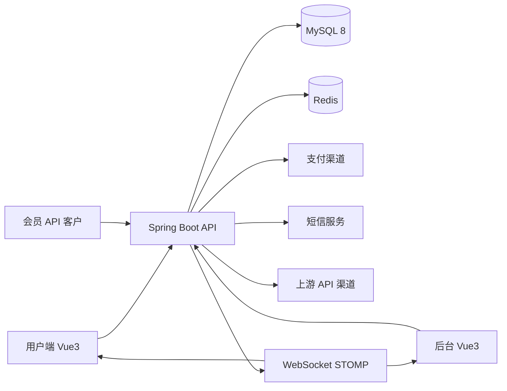

# 系统架构设计

## 1. 技术栈

| 层级 | 技术 |
| --- | --- |
| 用户端前端 | Vue 3、Vite、Pinia、Vue Router |
| 后台前端 | Vue 3、Vite、Pinia、Vue Router |
| 后端 | Spring Boot、Spring Security、Spring WebSocket |
| 数据库 | MySQL 8 |
| 缓存 | Redis |
| 实时通信 | WebSocket STOMP |
| 导出 | 后端异步任务生成文件 |

前后端通过 REST API 通信，订单状态、库存预警、上游状态等实时事件通过 WebSocket STOMP 推送给后台或用户端。

## 2. 总体架构

## 3. 后端模块拆分

| 模块 | 职责 |
| --- | --- |
| auth | 登录、注册、JWT/Session、后台 RBAC、API 签名 |
| user | 用户、用户组、会员 API 权限与限流配置 |
| catalog | 五级分类、平台标签、商品检索 |
| product | 商品、规格、价格、用户组可见性 |
| inventory | 卡密库存、导入、锁定、发放、作废 |
| order | 订单创建、状态流转、订单查询、订单导出 |
| payment | 支付单、支付回调、支付查询、退款单、幂等控制 |
| fulfillment | 卡密发放、直充任务、代充人工处理 |
| upstream | 上游渠道、路由、健康检查、成功率统计 |
| notify | 短信、站内通知、WebSocket STOMP 推送 |
| audit | 后台操作日志、敏感行为审计 |
| export | 异步导出任务、文件生成和下载 |

## 4. 核心数据模型

### 4.1 商品与分类

- category：五级分类节点，包含 parent_id、level、sort、status。
- platform：平台标签，包含 name、code、sort、status。
- product：商品主表，包含商品类型、标题、状态、分类、库存策略。
- product_sku：商品规格，包含价格、面值、库存展示、限购配置。
- product_platform：商品与平台标签关联。
- product_group_rule：商品对用户组的可见性、价格或折扣配置。

### 4.2 订单与支付

- order：业务订单主表，记录用户、商品、金额、状态、履约类型。
- order_item：订单明细，记录 SKU、数量、单价和商品快照。
- payment_order：支付单，记录支付渠道、金额、状态、第三方交易号。
- payment_callback_log：支付回调原文、验签结果、处理结果和幂等键。
- refund_order：退款单，记录退款金额、原因、状态和幂等键。

订单与支付单分离，业务订单只根据支付单的最终成功事件推进履约。

### 4.3 卡密库存

- card_secret：卡密库存表，记录商品、SKU、卡号/密钥密文、哈希、状态。
- card_secret_lock_log：库存锁定与发放日志。
- card_secret_import_batch：导入批次、成功数、重复数、失败数。

卡密明文应按业务安全等级决定是否加密存储。至少需要保存哈希用于去重，展示时控制权限与脱敏策略。

### 4.4 直充与上游

- recharge_task：直充任务表，记录订单、渠道、请求参数、状态、重试次数。
- upstream_channel：上游渠道配置。
- upstream_route_rule：渠道路由规则。
- upstream_call_log：请求响应日志、耗时、错误码。
- upstream_health_metric：渠道成功率、延迟、可用性指标。

直充任务表是后续扩展的关键边界：支付成功只创建任务，任务执行、重试、路由和补偿独立处理。

### 4.5 审计与导出

- audit_log：后台账号、动作、资源、前后值、IP、User-Agent、时间。
- export_task：导出任务类型、筛选条件、状态、文件地址、创建人。

## 5. 缓存设计

Redis 用于缓存高频读取数据和短生命周期幂等标记。

建议缓存：

- 启用分类树。
- 平台过滤项。
- 商品列表页查询结果。
- 商品详情中的低频变更字段。
- 用户组权限摘要。
- 支付回调幂等短锁。
- 会员 API 限流计数。

缓存失效：

- 商品、分类、平台、用户组权限变更时主动删除相关缓存。
- 订单、支付、库存写路径不依赖缓存判断最终一致性。
- 卡密扣减以 MySQL 事务结果为准。

## 6. 一致性与幂等

### 6.1 支付回调幂等

- 以支付渠道、第三方交易号、支付单号组成唯一幂等键。
- 回调日志先落库，再进入业务处理。
- 支付单状态只能从待支付流转为支付成功或支付失败。
- 已成功的支付单重复回调直接返回成功响应。
- 履约触发必须检查订单状态，避免重复发卡。

### 6.2 退款幂等

- 退款单需要业务退款号，并建立唯一索引。
- 对外请求使用固定退款号重试。
- 第三方退款回调与主动查询都更新同一退款单。
- 已完成退款不得重复扣减或重复关闭订单。

### 6.3 卡密库存强一致

推荐流程：

1. 支付成功事件进入事务。
2. 查询订单并锁定订单行。
3. 按 SKU 查询未售卡密并使用行级锁锁定。
4. 将卡密更新为已售并绑定订单。
5. 将订单状态推进为已发货或已完成。
6. 写入发卡日志并提交事务。

在 MySQL 8 中可考虑使用 `SELECT ... FOR UPDATE SKIP LOCKED` 获取可售库存，结合唯一约束防止同一张卡密绑定多个订单。

## 7. WebSocket STOMP 事件

| 事件 | 目标 | 场景 |
| --- | --- | --- |
| order.status.changed | 用户端、后台 | 订单状态变化 |
| inventory.low | 后台 | 卡密库存低于阈值 |
| export.finished | 后台 | 导出任务完成 |
| upstream.health.changed | 后台 | 上游渠道可用性变化 |
| manual.task.assigned | 后台 | 代充任务分配 |

所有事件都应有服务端权限校验，避免用户订阅他人订单。

## 8. 安全设计

- 用户端接口使用登录态或 JWT 认证。
- 会员 API 使用 accessKey、timestamp、nonce、signature 防重放。
- 后台接口使用 RBAC 权限控制。
- 后台敏感操作写审计日志。
- 卡密明文读取需要独立权限点。
- 支付回调必须验签并记录原始报文。
- 导出文件设置过期时间和下载鉴权。

## 9. 部署建议

MVP 可采用单体 Spring Boot 应用加两个 Vue 前端构建产物独立部署。后续订单量上升后，可优先拆分异步任务、导出任务和上游履约执行器。

推荐环境：

- dev：本地开发环境。
- test：联调与验收环境。
- prod：生产环境，支付、短信、上游配置隔离。

配置应通过环境变量或配置中心注入，禁止将支付密钥、短信密钥、上游密钥写入代码仓库。
