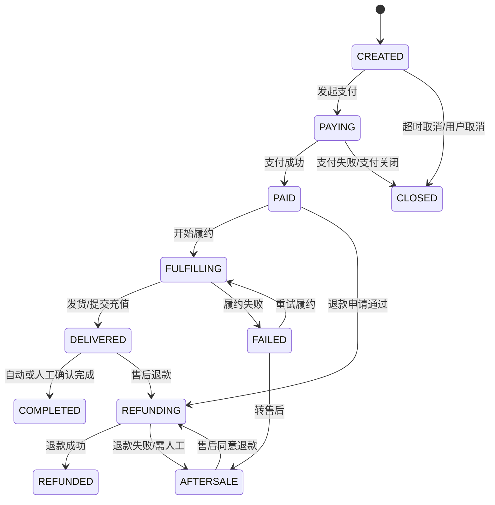

# 订单状态机

## 1. 设计目标

订单状态机用于约束订单从创建到支付、履约、完成、关闭、退款的全过程，避免重复发卡、非法退款、状态回退和人工误操作。

核心原则：

- 订单状态只能按定义流转。
- 支付状态、履约状态、退款状态分开建模，订单主状态展示最终业务进度。
- 支付回调、退款回调和履约任务都必须幂等。
- 卡密发放必须和库存状态变更在同一数据库事务内完成。

## 2. 状态维度

### 2.1 订单主状态

| 状态 | 说明 | 终态 |
| --- | --- | --- |
| CREATED | 已创建，待支付 | 否 |
| PAYING | 支付中 | 否 |
| PAID | 已支付，待履约 | 否 |
| FULFILLING | 履约中 | 否 |
| DELIVERED | 已发货或已提交充值 | 否 |
| COMPLETED | 已完成 | 是 |
| CLOSED | 已关闭，未支付或超时取消 | 是 |
| REFUNDING | 退款中 | 否 |
| REFUNDED | 已退款 | 是 |
| AFTERSALE | 售后处理中 | 否 |
| FAILED | 履约失败，待人工处理 | 否 |

### 2.2 支付状态

| 状态 | 说明 |
| --- | --- |
| UNPAID | 未支付 |
| PAYING | 支付中 |
| SUCCESS | 支付成功 |
| FAILED | 支付失败 |
| CLOSED | 支付关闭 |

### 2.3 履约状态

| 状态 | 适用商品 | 说明 |
| --- | --- | --- |
| NOT_STARTED | 全部 | 未开始履约 |
| CARD_LOCKING | 卡密 | 正在锁定库存 |
| CARD_DELIVERED | 卡密 | 卡密已发放 |
| RECHARGE_TASK_CREATED | 直充 | 已创建直充任务 |
| RECHARGING | 直充 | 上游处理中 |
| MANUAL_PENDING | 代充 | 待人工处理 |
| MANUAL_PROCESSING | 代充 | 人工处理中 |
| SUCCESS | 全部 | 履约成功 |
| FAILED | 全部 | 履约失败 |

### 2.4 退款状态

| 状态 | 说明 |
| --- | --- |
| NONE | 无退款 |
| REQUESTED | 已申请 |
| REVIEWING | 审核中 |
| PROCESSING | 退款处理中 |
| SUCCESS | 退款成功 |
| FAILED | 退款失败 |
| REJECTED | 退款驳回 |

## 3. 主状态流转

## 4. 商品类型流转

### 4.1 卡密商品

推荐流转：

1. CREATED：订单创建。
2. PAYING：用户发起支付。
3. PAID：支付回调成功。
4. FULFILLING：进入发卡事务。
5. DELIVERED：卡密绑定订单并可展示。
6. COMPLETED：自动完成或用户确认。

异常流转：

- 支付成功但库存不足：PAID -> FAILED，进入人工处理或退款。
- 支付成功但发卡事务异常：PAID/FULFILLING -> FAILED，由补偿任务重试。
- 卡密已发放后退款：进入 AFTERSALE，由人工审核。

### 4.2 直充商品

推荐流转：

1. 支付成功后创建 recharge_task。
2. 订单进入 FULFILLING。
3. 上游受理后进入 DELIVERED。
4. 上游返回成功后进入 COMPLETED。
5. 上游失败后进入 FAILED，可重试、换渠道或人工处理。

直充任务状态独立于订单主状态，订单只展示汇总结果。

### 4.3 代充商品

推荐流转：

1. 支付成功后进入 FULFILLING。
2. 创建人工处理任务，履约状态为 MANUAL_PENDING。
3. 后台人员领取后进入 MANUAL_PROCESSING。
4. 处理完成后订单进入 DELIVERED 或 COMPLETED。
5. 无法处理时进入 FAILED 或 AFTERSALE。

所有人工操作必须写入审计日志。

## 5. 流转事件

| 事件 | 来源 | 前置状态 | 目标状态 |
| --- | --- | --- | --- |
| ORDER_CREATED | 用户端/API | 无 | CREATED |
| PAYMENT_STARTED | 用户端 | CREATED | PAYING |
| PAYMENT_SUCCESS | 支付回调/主动查询 | CREATED/PAYING | PAID |
| PAYMENT_FAILED | 支付回调/主动查询 | PAYING | CLOSED |
| ORDER_TIMEOUT | 定时任务 | CREATED/PAYING | CLOSED |
| FULFILLMENT_STARTED | 系统 | PAID | FULFILLING |
| CARD_DELIVERED | 发卡服务 | FULFILLING | DELIVERED |
| RECHARGE_ACCEPTED | 上游服务 | FULFILLING | DELIVERED |
| FULFILLMENT_SUCCESS | 系统/人工 | DELIVERED/FULFILLING | COMPLETED |
| FULFILLMENT_FAILED | 系统/人工 | FULFILLING | FAILED |
| FULFILLMENT_RETRY | 后台/补偿任务 | FAILED | FULFILLING |
| REFUND_APPROVED | 后台/售后 | PAID/DELIVERED/AFTERSALE | REFUNDING |
| REFUND_SUCCESS | 退款回调/主动查询 | REFUNDING | REFUNDED |
| REFUND_FAILED | 退款回调/主动查询 | REFUNDING | AFTERSALE |

## 6. 非法流转示例

以下流转必须被拦截：

- CLOSED -> PAID：已关闭订单不能被支付成功回调重新激活，除非人工创建修复流程。
- COMPLETED -> FULFILLING：已完成订单不能再次履约。
- REFUNDED -> FULFILLING：已退款订单不能再次履约。
- DELIVERED -> CLOSED：已发货订单不能直接关闭。
- CARD_DELIVERED -> CARD_LOCKING：已发卡库存不能回退为锁定。

## 7. 幂等规则

### 7.1 订单创建

- 用户端订单创建可使用 client_request_id 防重复提交。
- 会员 API 订单创建必须传入外部订单号，并对同一 API 用户建立唯一约束。
- 重复请求返回原订单结果，不重复扣库存或生成支付单。

### 7.2 支付成功

- 支付单号唯一。
- 第三方交易号唯一。
- 回调日志幂等键唯一。
- 支付状态已为 SUCCESS 时重复回调直接返回成功。
- 触发履约前必须检查订单是否已经进入 FULFILLING、DELIVERED、COMPLETED 或 REFUNDED。

### 7.3 卡密发放

- card_secret.order_id 唯一绑定实际发放订单。
- 发卡事务内同时更新订单状态、库存状态和发卡日志。
- 同一订单重复触发发卡时，若已有绑定卡密，直接返回已有卡密。
- 库存不足时不得部分发放，除非商品明确支持拆单。

### 7.4 退款

- 退款业务号唯一。
- 第三方退款单号唯一。
- 退款成功回调重复到达时只更新回调日志。
- 已退款订单不可再次发起全额退款。

## 8. 数据库约束建议

建议添加以下唯一约束或索引：

- payment_order.pay_no 唯一。
- payment_order.channel_trade_no 唯一，允许未支付时为空。
- payment_callback_log.idempotency_key 唯一。
- refund_order.refund_no 唯一。
- refund_order.channel_refund_no 唯一，允许处理中为空。
- card_secret.secret_hash 唯一。
- card_secret.order_id 普通索引；如一订单只发一张卡可设唯一，支持多张则建发卡明细表唯一约束。
- member_api_order.user_id + external_order_no 唯一。

## 9. 补偿任务

| 任务 | 扫描条件 | 动作 |
| --- | --- | --- |
| 支付状态修复 | PAYING 超过指定时间 | 主动查询支付渠道 |
| 发卡补偿 | PAID 或 FULFILLING 超过指定时间且未发卡 | 重试发卡事务 |
| 直充补偿 | 直充任务长时间处理中 | 查询上游或重试 |
| 退款补偿 | REFUNDING 超过指定时间 | 主动查询退款状态 |
| 订单关闭 | CREATED/PAYING 超时未支付 | 关闭订单和支付单 |

补偿任务需要分布式锁或任务抢占机制，避免多实例重复处理同一订单。

## 10. 后台人工干预

允许后台人工操作：

- 将 FAILED 重试为 FULFILLING。
- 将 FAILED 转入 AFTERSALE。
- 审核退款并进入 REFUNDING。
- 标记代充任务完成。
- 对异常订单添加备注。

人工操作要求：

- 必须校验 RBAC 权限。
- 必须填写原因。
- 必须写 audit_log。
- 不允许绕过支付成功校验直接发卡。
